# Serverless CRUD API with APIGateway, Lambda & DynamoDB

A fully serverless REST API built on AWS that performs CRUD operations on a DynamoDB table. A single Lambda function acts as an operation router.One POST endpoint, one function, five DynamoDB operations.

## High- Level Architecture

i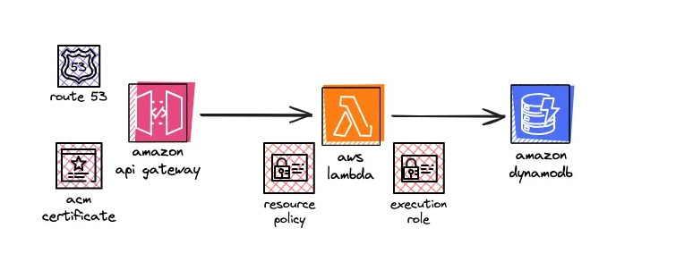

*  **Amazon API Gateway** — exposes a REST API (DynamoDBOperations) with a single resource (/dynamodbmanager) and a POST method, deployed to a Prod stage. 

*  **AWS Lambda** (LambdaFunctionOverHttps, Python 3.13) — receives the request payload, determines which operation to run, and calls the matching DynamoDB action via boto3.
* **Amazon DynamoDB** — table lambda-apigateway with id (String) as the partition key.
* **IAM** — a custom least-privilege policy attached to the Lambda execution role, scoped only to the DynamoDB actions the function actually uses.

## How it works

The Lambda function reads an operation field from the incoming JSON payload and dispatches it to the corresponding DynamoDB API call using a dispatch dictionary instead of a long if/elif chain:

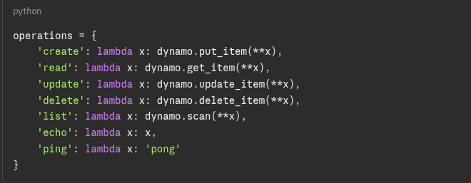

If the _**tableName**_ field is present in the request, the function connects to that DynamoDB table via ***boto3.resource('dynamodb').Table(...)***. The ***payload*** field is passed through as keyword arguments to the relevant **boto3** method — so its structure must match what that method expects (e.g. **_Item={...}_** **for create, Key={...}** for **read/update/delete)**.

**echo** and **ping** don't touch DynamoDB at all — they exist purely to test that the Lambda function and API Gateway integration are wired up correctly before any AWS resources are created.

## Step-by-Step Deployment Guide

### Enforce Least-Privilege IAM Policies

* Created a custom least-privilege IAM policy (_lambda-custom-policy_) scoped to the specific DynamoDB actions the function needs.

1. Open the **Policies** page in the IAM Console and click **Create Policy**.

2. Select the JSON editor and paste the configuration located in _iam-policy.json_. This scopes Lambda capabilities down exclusively to required DynamoDB table mechanics and CloudWatch logging permissions.

3. Name the policy _lambda-custom-policy_.

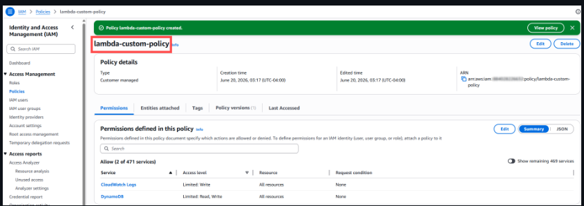

* Created an execution role (_lambda-apigateway-role_) with AWS Lambda as the trusted entity, and attached the custom policy.

1. Go to **Roles** > Create Role. Choose **AWS Service** and select **Lambda** as the use case. Attach _lambda-custom-policy_ and name the role **_lambda-apigateway-role_**.

### Lambda Function

Created *_LambdaFunctionOverHttps_* (Python 3.13 runtime), using the execution role above.Deployed the code in **lambda_function.py**.

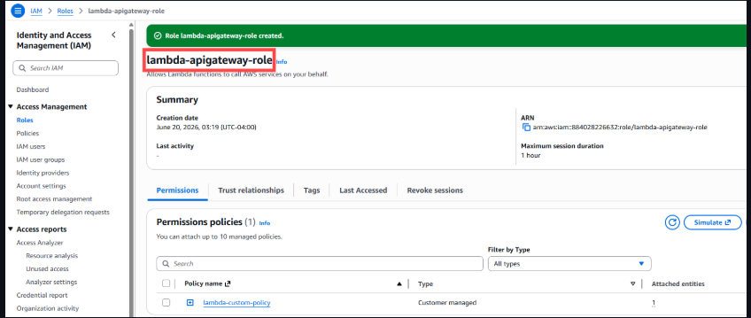

1. Provision an AWS Lambda function from scratch named LambdaFunctionOverHttps using Python 3.13.
2. Under Permissions, change the default execution role to Use an existing role and select _lambda-apigateway-role_.
3. Swap out the boilerplate execution code with the routing block located in _lambda_function.py_ and click **Deploy**.
4. Run an execution test named _echotest_ inside the console with an echo operation payload to confirm the runtime logic is sound.

### Provision the DynamoDB Table

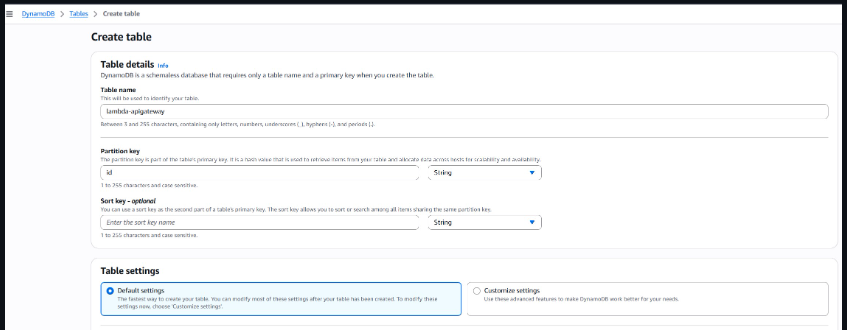

1. Open the **DynamoDB Console** and click **Create Table**.
2. Deploy a table named exactly _lambda-apigateway_.
3. Specify your Partition Key as id with a data type of **String**. Leave everything else as default and create the table.

### Configure API Gateway Routing

Created a REST API called _DynamoDBOperation_ . Added a resource _/dynamodbmanager_ and added a **Post** method on that resource, integrated with _LambdaFunctionOverHttps_.

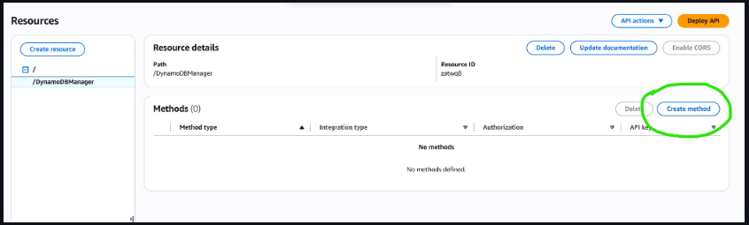

1. Inside the **API Gateway Console**, create a new **REST API** named _DynamoDBOperations_.
2. Click **Create Resource** and enter _DynamoDBManager_ (Path: /dynamodbmanager).
3. Select your new resource, click **Create Method**, choose **POST**, and select _LambdaFunctionOverHttps_ as the integration backend function.
4. Click **Deploy API**, select [New Stage], name it Prod, and copy your active **Invoke URL**.

### Testing

The full CRUD flow was tested end-to-end using Postman, with results verified directly in the DynamoDB console (Explore table items).

### Create an item

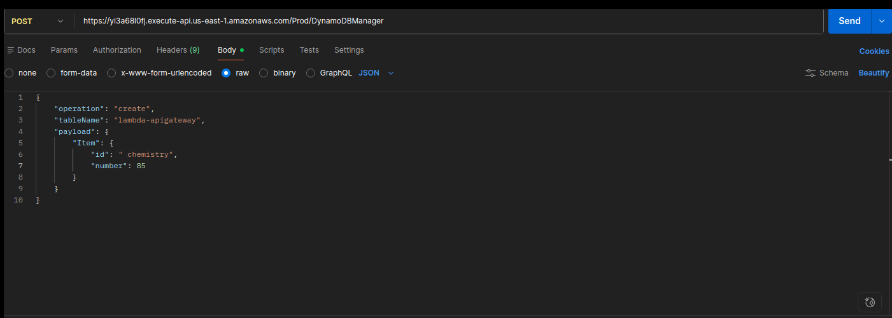

### List all items

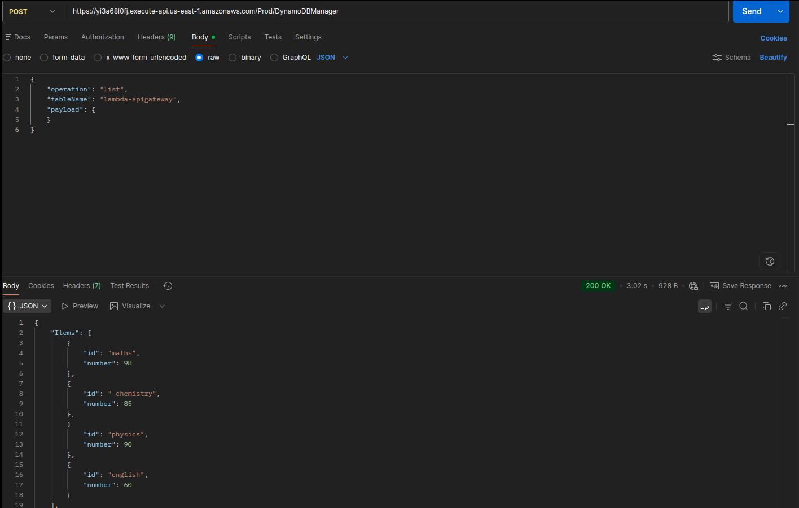
_postman_

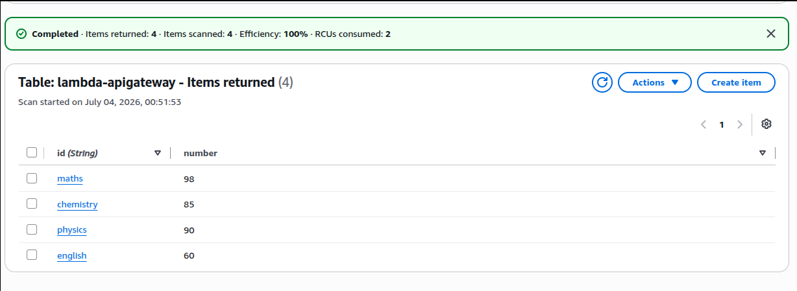
_console_

### Update an item

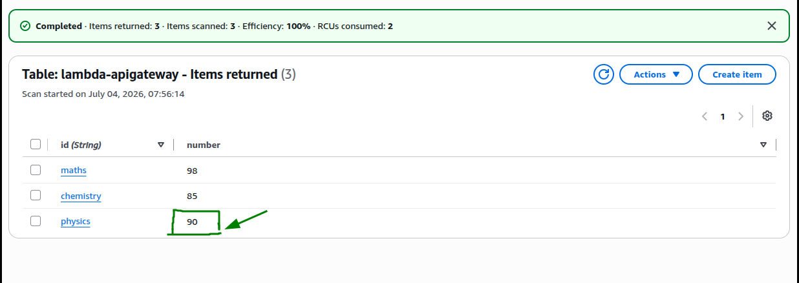
_before update_

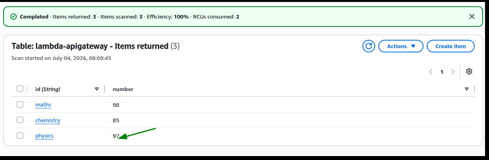
_after update_

### Delete

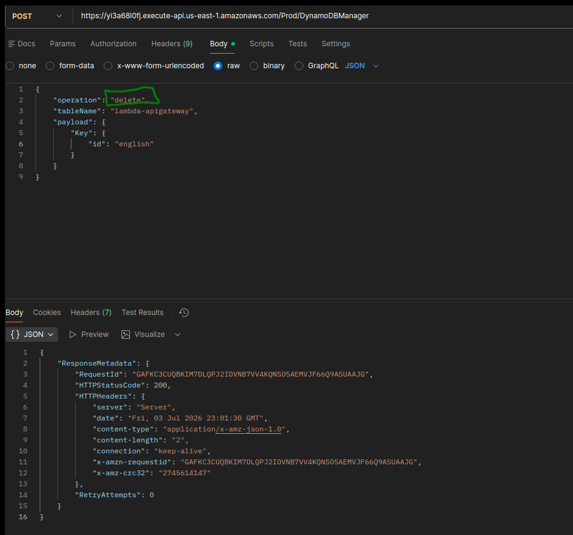

### Tech Stack

+ Amazon API Gateway (REST API)
+ AWS Lambda (Python 3.13, boto3)
+ Amazon DynamoDB
+ AWS IAM (custom least-privilege policy)
+ Postman (testing)
